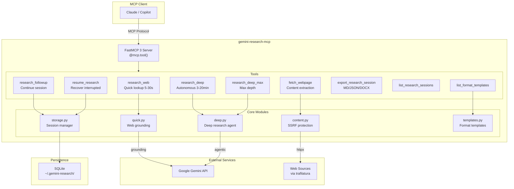

# Gemini Research MCP Server

[](https://pypi.org/project/gemini-research-mcp/)
[](https://www.python.org/downloads/)
[](https://opensource.org/licenses/MIT)

MCP server for AI-powered research using **Gemini**. Fast grounded search, URL extraction, comprehensive Deep Research, and session management.

## Architecture


<details>
<summary>Mermaid source</summary>


```mermaid
flowchart TB
    subgraph Client["MCP Client"]
        Claude["Claude / Copilot"]
    end

    subgraph Server["gemini-research-mcp"]
        direction TB
        FastMCP["FastMCP 3 Server<br/>@mcp.tool()"]
        
        subgraph Tools["Tools"]
            RW["research_web<br/>Quick lookup 5-30s"]
            RD["research_deep<br/>Autonomous 3-20min"]
            RDM["research_deep_max<br/>Max depth"]
            RF["research_followup<br/>Continue session"]
            RR["resume_research<br/>Recover interrupted"]
            FW["fetch_webpage<br/>Content extraction"]
            EX["export_research_session<br/>MD/JSON/DOCX"]
            LS["list_research_sessions"]
            LT["list_format_templates"]
        end

        subgraph Modules["Core Modules"]
            Quick["quick.py<br/>Web grounding"]
            Deep["deep.py<br/>Deep research agent"]
            Content["content.py<br/>SSRF protection"]
          StorageMod["storage.py<br/>Session manager"]
            Templates["templates.py<br/>Format templates"]
        end
    end

    subgraph External["External Services"]
        Gemini["Google Gemini API"]
        Web["Web Sources<br/>via trafilatura"]
    end

    subgraph Storage["Persistence"]
        SQLite["SQLite<br/>~/.gemini-research/"]
    end

    Claude -->|"MCP Protocol"| FastMCP
    FastMCP --> Tools
    
    RW --> Quick
    RD --> Deep
    RDM --> Deep
    RF --> StorageMod
    RR --> StorageMod
    FW --> Content
    LT --> Templates
    
    Quick -->|"grounding"| Gemini
    Deep -->|"agentic"| Gemini
    Content -->|"httpx"| Web
    StorageMod --> SQLite
```

</details>

## Tools

| Tool | Description | Latency |
|------|-------------|---------|
| `research_web` | Fast web search with citations | 5-30 sec |
| `research_deep` | Multi-step autonomous research (MCP Tasks) | 3-20 min |
| `research_deep_max` | Maximum-comprehensiveness Deep Research for exhaustive/high-stakes work | longer-running |
| `resume_research` | Resume interrupted/in-progress sessions | instant |
| `research_followup` | Continue conversation after research | 5-30 sec |
| `list_research_sessions` | List saved research sessions | instant |
| `list_format_templates` | Browse report format templates | instant |
| `export_research_session` | Export to Markdown, JSON, or DOCX | instant |
| `fetch_webpage` | Extract article content from a specific URL (SSRF-protected, chunkable) | 0.5-2 sec |

### `fetch_webpage` Parameters

The `fetch_webpage` tool supports chunked reading for large pages and optional proxy routing:

| Parameter | Type | Default | Description |
|-----------|------|---------|-------------|
| `url` | string | required | HTTP/HTTPS URL to fetch |
| `max_length` | integer \| null | `null` | Maximum characters to return (chunk size) |
| `start_index` | integer | `0` | Character offset for pagination |
| `proxy_url` | string \| null | `null` | Optional HTTP(S) proxy URL for the request |

Notes:
- SSRF protection is always applied (private/internal hosts are blocked).
- `robots.txt` is checked before fetch when `protego` is installed.
- When output is truncated, the response includes a continuation hint with next `start_index`.
- If `proxy_url` is omitted, the server falls back to `FETCH_PROXY_URL` when set.
- `proxy_url` must be a public HTTP(S) host (private/internal proxy hosts are blocked).

Install the `web` extra for the highest-quality `fetch_webpage` experience:

```bash
pip install 'gemini-research-mcp[web]'
# or
uv add 'gemini-research-mcp[web]'
```

Without `[web]`, `fetch_webpage` still works using the built-in HTML fallback, but `trafilatura`
extraction and `protego`-based `robots.txt` checks are unavailable.

### Power User Workflow

[](docs/workflow.svg)

> **Key insight**: Gemini Deep Research runs asynchronously on Google's servers. Even if VS Code disconnects, your research continues. The `resume_research` tool retrieves completed work.

### Features

- **Auto-Clarification**: `research_deep` asks clarifying questions for vague queries via [MCP Elicitation](https://modelcontextprotocol.io/specification/2025-11-25/client/elicitation)
- **Deep Research Max**: `research_deep_max` exposes Google's Max agent for exhaustive, high-stakes, and offline research workflows
- **MCP Tasks**: [Real-time progress](https://modelcontextprotocol.io/specification/2025-11-25/basic/utilities/tasks) with streaming updates
- **Session Persistence**: Research sessions are automatically saved and can be resumed later
- **Export Formats**: Export to Markdown, JSON, or professional DOCX with Table of Contents
- **File Search**: Search your own data alongside web using `file_search_store_names`
- **Format Instructions**: Control report structure (sections, tables, tone)

## Installation

### PyPI (recommended)

```bash
pip install gemini-research-mcp
# or
uv add gemini-research-mcp
```

### Claude Desktop (MCPB Bundle)

Download the `.mcpb` bundle from [GitHub Releases](https://github.com/machinemates-ai/gemini-research-mcp/releases) and open it in Claude Desktop for single-click installation.

The bundle uses UV runtime - dependencies are installed automatically, no Python required.

## Configuration

| Variable | Required | Default | Description |
|----------|----------|---------|-------------|
| `GEMINI_API_KEY` | **Yes** | — | [Google AI Studio API key](https://aistudio.google.com/apikey) |
| `GEMINI_MODEL` | No | `gemini-3.1-pro-preview` | Model for `research_web` |
| `GEMINI_SUMMARY_MODEL` | No | `gemini-3-flash-preview` | Model for session summaries (fast) |
| `DEEP_RESEARCH_AGENT` | No | `deep-research-preview-04-2026` | Default agent for `research_deep`; accepts `fast`, `standard`, `deep-research`, `max`, `deep-research-max`, or exact agent IDs |
| `FETCH_PROXY_URL` | No | — | Default HTTP(S) proxy for `fetch_webpage` |

```bash
cp .env.example .env
# Edit .env with your API key
```

### Deep Research vs Deep Research Max

Google exposes Deep Research variants through the Gemini Interactions API `agent`
field, not the regular Gemini `model` field:

- `research_deep` uses `deep-research-preview-04-2026` by default. Use it for
  interactive research, comparisons, investigations, and latency/cost-sensitive
  synthesis.
- `research_deep_max` uses `deep-research-max-preview-04-2026`. Use it when the
  user explicitly asks for Max, exhaustive/comprehensive due diligence, market
  maps, literature reviews, board-ready reports, offline/nightly research, or
  maximum completeness over speed.

For Copilot and other LLM clients, the two tools are intentionally separate so
Max can be selected from the tool name and description. There is no public
`model` parameter for Deep Research, because follow-up and quick research use
Gemini models while Deep Research uses Interactions agents.

## Usage

### VS Code MCP

Add to `.vscode/mcp.json`:

```json
{
  "servers": {
    "gemini-research": {
      "command": "uvx",
      "args": ["gemini-research-mcp"],
      "env": {
        "GEMINI_API_KEY": "your-api-key"
      }
    }
  }
}
```

Or run from source:

```json
{
  "servers": {
    "gemini-research": {
      "command": "uv",
      "args": ["run", "--directory", "path/to/gemini-research-mcp", "gemini-research-mcp"],
      "envFile": "${workspaceFolder}/path/to/gemini-research-mcp/.env"
    }
  }
}
```

### Command Line

```bash
uv run gemini-research-mcp
# or
uvx gemini-research-mcp
```

## DOCX Export

Export research sessions to professional Word documents with:

- **Cover page** with title, date, and research metadata
- **Clickable Table of Contents** with navigation to sections
- **Professional typography**: Calibri fonts, 1-inch margins, 1.5x line spacing
- **Executive summary** with elegant formatting
- **Full research report** with proper heading hierarchy
- **Sources section** with full clickable URLs
- **Metadata table** with session details

### VS Code Setup

To enable DOCX export, install with the `[docx]` extra:

```json
{
  "servers": {
    "gemini-research": {
      "command": "uvx",
      "args": ["--from", "gemini-research-mcp[docx]", "gemini-research-mcp"],
      "env": {
        "GEMINI_API_KEY": "your-api-key"
      }
    }
  }
}
```

### Downloading Files

After running `export_research_session` with `format: "docx"`, the tool returns a resource URI:

```
research://exports/{export_id}
```

In **VS Code Copilot Chat**, you can:
- **Click "Save"** on the resource attachment to download the `.docx` file
- **Drag-and-drop** from the chat into your workspace

### Installation (pip/uv)

```bash
# Install with DOCX support
pip install 'gemini-research-mcp[docx]'
# or
uv add 'gemini-research-mcp[docx]'
```

### Features

| Feature | Description |
|---------|-------------|
| **Cover Page** | Title, date, duration, tokens, AI agent |
| **Clickable TOC** | Internal hyperlinks navigate to sections |
| **Syntax Highlighting** | Pygments-powered code blocks with GitHub colors |
| **Professional Styling** | Calibri fonts, proper heading hierarchy (H1-H4) |
| **Page Margins** | Standard 1-inch (2.54cm) margins |
| **Heading Spacing** | `keep_with_next` prevents orphan headings |
| **Sources** | Full URLs as clickable hyperlinks |
| **Pure Python** | No external binaries (Pandoc not required) |

## Resources

MCP Resources provide read-only data that clients can access:

| Resource | Description |
|----------|-------------|
| `research://models` | Available models and their capabilities |
| `research://exports` | List cached exports ready for download |
| `research://exports/{id}` | Download an exported file (Markdown, JSON, or DOCX) |

### File Downloads

The `export_research_session` tool creates exports and returns a resource URI. Clients (like VS Code) can then fetch the resource to download the file with proper MIME type handling.

## Development

```bash
uv sync --extra dev
uv run pytest
uv run mypy src/
uv run ruff check src/
```

### Tests

```bash
uv run pytest                    # Unit tests
uv run pytest -m e2e             # E2E tests (requires GEMINI_API_KEY)
uv run pytest --cov=src/gemini_research_mcp  # With coverage
```

## Pricing

| Tool | Typical Cost |
|------|-------------|
| `research_web` | ~$0.01-0.05 per query |
| `research_deep` | ~$2-5 per task |

*Deep Research uses ~80-160 searches and ~250k-900k tokens per task.*

## License

MIT
