# Gemini Research MCP Server

[](https://pypi.org/project/gemini-research-mcp/)
[](https://www.python.org/downloads/)
[](https://opensource.org/licenses/MIT)

MCP server for AI-powered research using **Gemini**. Fast grounded search + comprehensive Deep Research + session management.

## Tools

| Tool | Description | Latency |
|------|-------------|---------|
| `research_web` | Fast web search with citations | 5-30 sec |
| `research_deep` | Multi-step autonomous research | 3-20 min |
| `resume_research` | Resume interrupted/in-progress sessions | instant |
| `research_followup` | Continue conversation after research | 5-30 sec |
| `list_research_sessions` | List saved research sessions | instant |
| `export_research_session` | Export to Markdown, JSON, or DOCX | instant |

### Power User Workflow

```mermaid
flowchart TD
    subgraph START ["🚀 Start Research"]
        A[Quick Question?] -->|Yes| B["research_web<br/>⚡ 5-30 sec"]
        A -->|Deep Analysis| C["research_deep<br/>🔬 3-20 min"]
    end

    subgraph INTERRUPT ["⚠️ Interruption"]
        C --> D{VS Code closes?<br/>Laptop sleeps?<br/>Network drops?}
        D -->|Yes| E["Session saved with<br/>interaction_id at START"]
        D -->|No| I
        E --> F["Gemini continues<br/>researching on servers"]
    end

    subgraph RESUME ["🔄 Resume Later"]
        F --> G[Reopen VS Code]
        G --> H["resume_research<br/>Check session status"]
        H -->|Completed| I["✅ Retrieve full report"]
        H -->|Still running| J["⏳ Poll for completion"]
        J --> H
    end

    subgraph EXPLORE ["💬 Explore Results"]
        B --> K{Need more<br/>depth?}
        K -->|"Deep dive"| C
        K -->|"Follow-up"| M
        K -->|No| L[Done]
        I --> M["research_followup<br/>Drill into sections"]
        M --> M
        M --> N{Share?}
        N -->|No| L
    end

    subgraph EXPORT ["📤 Export & Archive"]
        N -->|Yes| O["export_research_session"]
        O --> P["📄 DOCX - Share with team"]
        O --> Q["📝 Markdown - Import to another AI"]
        O --> R["🔧 JSON - Programmatic use"]
        P & Q & R --> L
    end

    subgraph LATER ["📅 Months Later"]
        L -.->|"Time passes..."| S
        S["What did I research<br/>about quantum computing?"] --> T["list_research_sessions"]
        T --> U["Find old session"]
        U --> M
        U --> O
    end

    style START fill:#e8f5e9
    style INTERRUPT fill:#fff3e0
    style RESUME fill:#e3f2fd
    style EXPLORE fill:#f3e5f5
    style EXPORT fill:#fce4ec
    style LATER fill:#e0f7fa
```



> **Key insight**: Gemini Deep Research runs asynchronously on Google's servers. Even if VS Code disconnects, your research continues. The `resume_research` tool retrieves completed work.

### Features

- **Auto-Clarification**: `research_deep` asks clarifying questions for vague queries via [MCP Elicitation](https://modelcontextprotocol.io/specification/2025-11-25/client/elicitation)
- **MCP Tasks**: [Real-time progress](https://modelcontextprotocol.io/specification/2025-11-25/basic/utilities/tasks) with streaming updates
- **Session Persistence**: Research sessions are automatically saved and can be resumed later
- **Export Formats**: Export to Markdown, JSON, or professional DOCX with Table of Contents
- **File Search**: Search your own data alongside web using `file_search_store_names`
- **Format Instructions**: Control report structure (sections, tables, tone)

## Installation

```bash
pip install gemini-research-mcp
# or
uv add gemini-research-mcp
```

From source:

```bash
git clone https://github.com/fortaine/gemini-research-mcp
cd gemini-research-mcp
uv sync
```

## Configuration

| Variable | Required | Default | Description |
|----------|----------|---------|-------------|
| `GEMINI_API_KEY` | **Yes** | — | [Google AI Studio API key](https://aistudio.google.com/apikey) |
| `GEMINI_MODEL` | No | `gemini-3-flash-preview` | Model for `research_web` |
| `GEMINI_SUMMARY_MODEL` | No | `gemini-3-flash-preview` | Model for session summaries (fast) |
| `DEEP_RESEARCH_AGENT` | No | `deep-research-pro-preview-12-2025` | Agent for `research_deep` |

```bash
cp .env.example .env
# Edit .env with your API key
```

## Usage

### VS Code MCP

Add to `.vscode/mcp.json`:

```json
{
  "servers": {
    "gemini-research": {
      "command": "uvx",
      "args": ["gemini-research-mcp"],
      "env": {
        "GEMINI_API_KEY": "your-api-key"
      }
    }
  }
}
```

Or run from source:

```json
{
  "servers": {
    "gemini-research": {
      "command": "uv",
      "args": ["run", "--directory", "path/to/gemini-research-mcp", "gemini-research-mcp"],
      "envFile": "${workspaceFolder}/path/to/gemini-research-mcp/.env"
    }
  }
}
```

### Command Line

```bash
uv run gemini-research-mcp
# or
uvx gemini-research-mcp
```

## DOCX Export

Export research sessions to professional Word documents with:

- **Cover page** with title, date, and research metadata
- **Clickable Table of Contents** with navigation to sections
- **Professional typography**: Calibri fonts, 1-inch margins, 1.5x line spacing
- **Executive summary** with elegant formatting
- **Full research report** with proper heading hierarchy
- **Sources section** with full clickable URLs
- **Metadata table** with session details

### VS Code Setup

To enable DOCX export, install with the `[docx]` extra:

```json
{
  "servers": {
    "gemini-research": {
      "command": "uvx",
      "args": ["--from", "gemini-research-mcp[docx]", "gemini-research-mcp"],
      "env": {
        "GEMINI_API_KEY": "your-api-key"
      }
    }
  }
}
```

### Downloading Files

After running `export_research_session` with `format: "docx"`, the tool returns a resource URI:

```
research://exports/{export_id}
```

In **VS Code Copilot Chat**, you can:
- **Click "Save"** on the resource attachment to download the `.docx` file
- **Drag-and-drop** from the chat into your workspace

### Installation (pip/uv)

```bash
# Install with DOCX support
pip install 'gemini-research-mcp[docx]'
# or
uv add 'gemini-research-mcp[docx]'
```

### Features

| Feature | Description |
|---------|-------------|
| **Cover Page** | Title, date, duration, tokens, AI agent |
| **Clickable TOC** | Internal hyperlinks navigate to sections |
| **Syntax Highlighting** | Pygments-powered code blocks with GitHub colors |
| **Professional Styling** | Calibri fonts, proper heading hierarchy (H1-H4) |
| **Page Margins** | Standard 1-inch (2.54cm) margins |
| **Heading Spacing** | `keep_with_next` prevents orphan headings |
| **Sources** | Full URLs as clickable hyperlinks |
| **Pure Python** | No external binaries (Pandoc not required) |

## Resources

MCP Resources provide read-only data that clients can access:

| Resource | Description |
|----------|-------------|
| `research://models` | Available models and their capabilities |
| `research://exports` | List cached exports ready for download |
| `research://exports/{id}` | Download an exported file (Markdown, JSON, or DOCX) |

### File Downloads

The `export_research_session` tool creates exports and returns a resource URI. Clients (like VS Code) can then fetch the resource to download the file with proper MIME type handling.

## Development

```bash
uv sync --extra dev
uv run pytest
uv run mypy src/
uv run ruff check src/
```

### Tests

```bash
uv run pytest                    # Unit tests
uv run pytest -m e2e             # E2E tests (requires GEMINI_API_KEY)
uv run pytest --cov=src/gemini_research_mcp  # With coverage
```

## Pricing

| Tool | Typical Cost |
|------|-------------|
| `research_web` | ~$0.01-0.05 per query |
| `research_deep` | ~$2-5 per task |

*Deep Research uses ~80-160 searches and ~250k-900k tokens per task.*

## License

MIT
